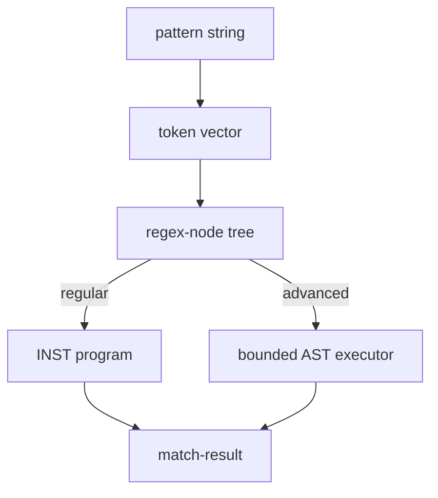

# Core concepts

`cl-regex-kit` compiles a pattern in three stages, following the Thompson NFA
and Pike VM design Russell Cox documents in
["Regular Expression Matching Can Be Simple and Fast"](https://swtch.com/~rsc/regexp/regexp1.html)
and its sequels, and that RE2 and Rust's `regex` crate also ship in
production.

A pattern string becomes a token vector (`regex-tokenizer.lisp`), which becomes
a `regex-node` tree (`regex-grammar.lisp`, `regex-grammar-support.lisp`, and
`regex-grammar-classes.lisp`). From there the path forks. A
regular pattern is compiled to a flat instruction program (`nfa.lisp`) and run
by the Pike VM (`pike-vm-*.lisp`). A pattern using advanced constructs keeps
its tree and is run by the bounded AST executor (`advanced-match.lisp`), through
the public execution boundary in `advanced-runner.lisp`, instead.
Both paths produce the same `match-result`.

## 1. Parsing (`src/regex-tokenizer.lisp`, `src/regex-grammar.lisp`, `src/regex-grammar-support.lisp`, `src/regex-grammar-classes.lisp`, `src/ast.lisp`)

`parse-regex` first tokenizes the pattern into a `(vector cl-parser-kit:token)`
(`regex-tokenizer.lisp`), then runs a hand-written recursive-descent parser
over that token vector (`regex-grammar.lisp`, with `regex-grammar-support.lisp`
and `regex-grammar-classes.lisp` supplying shared helpers and character-class
bodies):
alternation over concatenations, concatenation over repeated atoms, and an
atom is a literal, a group, a character class, `.`, an anchor, or one of the
advanced constructs such as a backreference or a lookaround. Every branch
point resolves on one token of lookahead, which is why this tier stays
recursive descent rather than a combinator pipeline; what `cl-parser-kit`
contributes is its token/span model and the tokenizer built on it.

The result is a tree of `regex-node` subclasses (`ast.lisp`) -- one class per
syntax feature, with no separate "optimized" tree, since the next stage
compiles this shape directly.

## 2. Thompson construction (`src/nfa.lisp`)

`compile-to-nfa` walks the AST and emits a flat program: a vector of `inst`
values. The consuming and control opcodes are `:char`, `:class`, `:any`,
`:line-break`, `:split`, `:jmp`, `:save`, and `:match`; each anchor kind
compiles to an opcode of its own (`:bol`, `:eol`, `:bos`, `:eos`,
`:boundary`, `:non-boundary`, `:word-start`, `:word-end`, and the two
half-boundary variants), so the VM tests an assertion by dispatching on the
instruction rather than by re-examining the AST. This is Thompson's
construction -- each node type expands to a small, fixed sequence of
instructions with epsilon-like control flow (`:split`, `:jmp`), so program size
stays linear in pattern size.

`:split` takes two targets and tries the first before the second, which is how
greedy-vs-lazy repetition and leftmost alternation encode their priority.

## 3. Pike's VM (`src/pike-vm-instructions.lisp`, `src/pike-vm-closure.lisp`, `src/pike-vm-capture.lisp`, `src/pike-vm-set.lisp`)

`run-pike-vm` executes the program against the input **without ever
backtracking**. Instead of following one path at a time and retrying on
failure, it advances a deduplicated *set* of active threads one input
character at a time:

1. Compute the epsilon-closure of the current thread set (follow every
   `:split`/`:jmp`/`:save` reachable without consuming input).
2. Deduplicate by program-counter, keeping only the highest-priority thread at
   each PC -- this is what bounds the thread count by program size and keeps
   matching linear in the input.
3. Step every surviving thread against the current input character.
4. Repeat until input is exhausted or every thread has died.

Because a failed thread is simply dropped from the set rather than retried,
there is no path that gets explored twice -- the mechanism that gives
backtracking engines their exponential worst case does not exist here.

### Captures without backtracking

Plain NFA/DFA simulation only tracks *which states are reachable*, not *how
they were reached*, so it cannot recover capture-group boundaries on its own.
Pike's VM fixes this by giving each thread its own capture-slot vector: a
`:save` instruction records the current input offset into that thread's slots.
When two threads reach the same program counter, only the higher-priority one
survives (per step 2 above) -- and priority order was assigned by `:split` to
match leftmost-first, greedy semantics -- so the recorded slots are always
consistent with what a backtracking engine would have found by exploring in
priority order.

## Comparison with backtracking

A textbook backtracking engine (and most engines you meet day to day: Perl,
PCRE, Python's `re`) explores one path at a time and retries on failure. On
adversarial patterns like `a?a?a?...aaa` against a run of `a`s, that degrades
to exponential time, because failed combinations get re-explored instead of
merged away. The thread-set simulation above never repeats work, so matching
time is `O(pattern-size * input-size)` regardless of the input.

The trade is an execution boundary: [backreferences, lookaround, and other
advanced constructs](../reference/compatibility.md) require runtime state
that a finite automaton cannot represent without giving up the linear-time
guarantee. `cl-regex-kit` keeps that guarantee for the regular path and routes
these constructs to a separate bounded executor
(`src/advanced-match.lisp`, entered through `src/advanced-runner.lisp`), which
evaluates the AST directly with ordered backtracking and bounded search. Such a pattern never reaches
`compile-to-nfa` at all -- it keeps its AST instead of gaining a program, and
`regex-advanced-p` reports which path a compiled regex took.

Advanced matches are bounded by the compile-time `:size-limit` and
`:nest-limit` rather than by the regular path's guarantee. Exhausting either
signals [`advanced-regex-limit-error`](../reference/conditions.md), so an
adversarial pattern fails loudly instead of running away.
